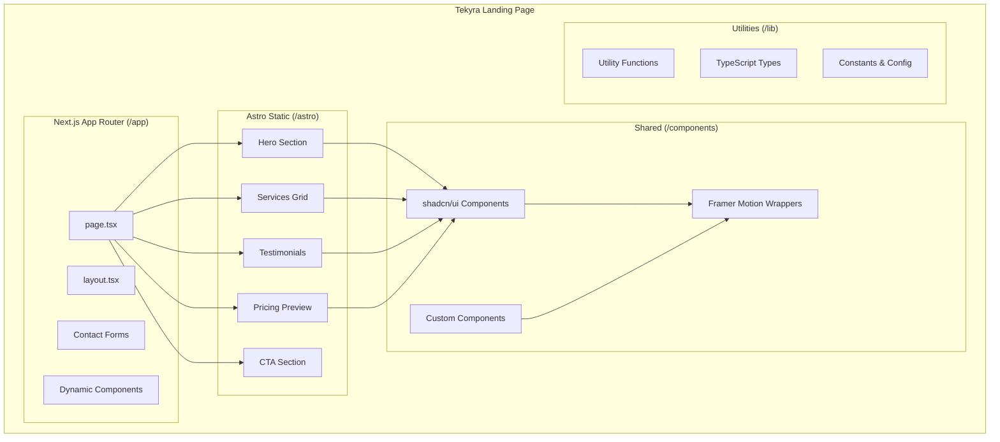

# Design Document: Tekyra Landing Page

## Overview

Tekyra es una landing page premium para una agencia de soluciones digitales potenciadas por IA. El proyecto implementa una arquitectura híbrida que combina Next.js 14 (App Router) para componentes dinámicos con Astro para secciones estáticas optimizadas. El diseño sigue una estética tecnológica minimalista con animaciones fluidas usando Framer Motion.

### Objetivos Técnicos
- Rendimiento óptimo mediante renderizado estático con Astro
- Interactividad rica donde sea necesario con Next.js
- Código modular y mantenible con TypeScript
- Diseño responsive mobile-first
- Animaciones premium con Framer Motion

## Architecture



### Estructura de Directorios

```
tekyra/
├── app/                          # Next.js App Router
│   ├── layout.tsx               # Root layout
│   ├── page.tsx                 # Main landing page
│   ├── globals.css              # Global styles
│   └── fonts/                   # Custom fonts
├── components/                   # Shared components
│   ├── ui/                      # shadcn/ui components
│   │   ├── button.tsx
│   │   ├── card.tsx
│   │   └── ...
│   ├── sections/                # Page sections
│   │   ├── hero.tsx
│   │   ├── services.tsx
│   │   ├── testimonials.tsx
│   │   ├── pricing.tsx
│   │   ├── cta.tsx
│   │   └── footer.tsx
│   └── animations/              # Framer Motion wrappers
│       ├── fade-up.tsx
│       ├── stagger-children.tsx
│       └── parallax.tsx
├── lib/                         # Utilities
│   ├── utils.ts                 # Helper functions
│   ├── constants.ts             # App constants
│   └── types.ts                 # TypeScript types
├── public/                      # Static assets
│   ├── images/
│   └── icons/
├── tailwind.config.ts           # Tailwind configuration
├── next.config.js               # Next.js configuration
└── package.json
```

## Components and Interfaces

### Core Components

#### 1. Hero Section
```typescript
interface HeroProps {
  title: string;
  subtitle: string;
  primaryCTA: {
    text: string;
    href: string;
  };
  secondaryCTA: {
    text: string;
    href: string;
  };
}
```

Responsabilidades:
- Renderizar sección full-screen con gradiente
- Mostrar título y subtítulo animados
- Renderizar botones CTA (primary y ghost)
- Aplicar animaciones fade-up, blur-out y parallax

#### 2. Services Grid
```typescript
interface Service {
  id: string;
  title: string;
  icon: LucideIcon;
  description: string;
  examples: string[];
}

interface ServicesGridProps {
  services: Service[];
}
```

Responsabilidades:
- Renderizar grid de 3 columnas (responsive)
- Mostrar cards con icono, título y ejemplos
- Aplicar animación stagger fade-in en scroll
- Aplicar hover effects (elevación + glow)

#### 3. Testimonials Carousel
```typescript
interface Testimonial {
  id: string;
  name: string;
  occupation: string;
  avatar: string;
  rating: number;
  quote: string;
}

interface TestimonialsProps {
  testimonials: Testimonial[];
}
```

Responsabilidades:
- Renderizar testimonios en carousel/grid
- Mostrar avatar, nombre, ocupación, rating y quote
- Permitir navegación entre testimonios

#### 4. Pricing Preview
```typescript
interface PricingItem {
  id: string;
  service: string;
  price: string;
  description?: string;
}

interface PricingPreviewProps {
  items: PricingItem[];
}
```

Responsabilidades:
- Renderizar cards de precios
- Mostrar nombre del servicio y precio
- Usar shadcn/ui Card components

#### 5. CTA Section
```typescript
interface CTAProps {
  headline: string;
  buttonText: string;
  buttonHref: string;
}
```

Responsabilidades:
- Renderizar sección con fondo oscuro
- Mostrar headline y botón prominente

#### 6. Footer
```typescript
interface FooterLink {
  label: string;
  href: string;
}

interface SocialLink {
  platform: string;
  icon: LucideIcon;
  href: string;
}

interface FooterProps {
  logo: string;
  email: string;
  links: FooterLink[];
  socialLinks: SocialLink[];
}
```

### Animation Components

#### FadeUp Wrapper
```typescript
interface FadeUpProps {
  children: React.ReactNode;
  delay?: number;
  duration?: number;
}
```

#### StaggerChildren Wrapper
```typescript
interface StaggerChildrenProps {
  children: React.ReactNode;
  staggerDelay?: number;
}
```

## Data Models

### Service Data
```typescript
const services: Service[] = [
  {
    id: 'ai-chatbots',
    title: 'AI Chatbots',
    icon: Bot,
    description: 'Intelligent conversational AI solutions',
    examples: [
      'Customer Support Chatbot',
      'Lead Qualification Bot',
      'Website Embedded Troubleshooter',
      'FAQ Automation Bot'
    ]
  },
  {
    id: 'business-automations',
    title: 'Business Automations',
    icon: Workflow,
    description: 'Streamline your business processes',
    examples: [
      'CRM automation',
      'Email sequences',
      'Booking + payments automation',
      'Data scraping + reporting'
    ]
  },
  {
    id: 'web-development',
    title: 'Web Development',
    icon: Laptop,
    description: 'Modern web solutions',
    examples: [
      'Landing pages',
      'E-commerce',
      'Business websites',
      'SaaS dashboards'
    ]
  }
];
```

### Testimonials Data
```typescript
const testimonials: Testimonial[] = [
  {
    id: '1',
    name: 'Linda',
    occupation: 'Yoga Studio Owner',
    avatar: '/images/avatars/linda.jpg',
    rating: 5,
    quote: 'Tekyra transformed my studio\'s online presence. Everything feels so professional and smooth.'
  },
  {
    id: '2',
    name: 'Kyle',
    occupation: 'Sales Consultant',
    avatar: '/images/avatars/kyle.jpg',
    rating: 5,
    quote: 'The automation Tekyra built saves me hours every week. Absolute game changer.'
  },
  {
    id: '3',
    name: 'Mickey',
    occupation: 'Martial Arts School',
    avatar: '/images/avatars/mickey.jpg',
    rating: 5,
    quote: 'The new website is clean, fast, and brings new clients every week.'
  },
  {
    id: '4',
    name: 'Joaquín',
    occupation: 'Organic Farm Owner',
    avatar: '/images/avatars/joaquin.jpg',
    rating: 5,
    quote: 'My farm finally has a proper online identity. Tekyra is worth every dollar.'
  }
];
```

### Pricing Data
```typescript
const pricingItems: PricingItem[] = [
  { id: '1', service: 'Landing Pages', price: 'from $700' },
  { id: '2', service: 'Websites', price: 'from $1500' },
  { id: '3', service: 'AI Chatbots', price: 'from $1200' },
  { id: '4', service: 'Automation Systems', price: '$1500–$3000' },
  { id: '5', service: 'Monthly Maintenance', price: '$200–$350' }
];
```

### Design Tokens
```typescript
const colors = {
  primary: {
    deep: '#0A2A43',    // Azul profundo
    cyan: '#00C6E6',    // Cian
  },
  neutral: {
    white: '#FFFFFF',
    black: '#0B0B0B',   // Negro suave
  }
};
```

## Correctness Properties

*A property is a characteristic or behavior that should hold true across all valid executions of a system-essentially, a formal statement about what the system should do. Properties serve as the bridge between human-readable specifications and machine-verifiable correctness guarantees.*

### Property 1: TypeScript Compilation Success
*For any* source file in the project, the TypeScript compiler should produce zero errors when building the project.
**Validates: Requirements 1.5**

### Property 2: Testimonial Rendering Completeness
*For any* testimonial data object with valid fields (name, occupation, avatar, rating, quote), the rendered testimonial component should contain all five elements visible in the output.
**Validates: Requirements 4.2**

### Property 3: Pricing Card Data Integrity
*For any* pricing item with a service name and price, the rendered pricing card should display both the service name and the price value.
**Validates: Requirements 5.3**

## Error Handling

### Component Error Boundaries
- Cada sección principal tendrá un Error Boundary de React
- Los errores se capturan y muestran un fallback UI amigable
- Los errores se loguean para debugging

### Data Validation
- Los datos de testimonios y precios se validan con TypeScript
- Valores faltantes usan defaults seguros
- Imágenes faltantes usan placeholders

### Animation Fallbacks
- Si Framer Motion falla, los componentes renderizan sin animación
- Respeta `prefers-reduced-motion` del usuario

## Testing Strategy

### Testing Framework
- **Unit Testing**: Vitest + React Testing Library
- **Property-Based Testing**: fast-check
- **E2E Testing**: Playwright (opcional)

### Unit Tests
Los unit tests verificarán:
- Renderizado correcto de cada sección
- Presencia de contenido esperado (títulos, botones, etc.)
- Aplicación correcta de clases CSS
- Comportamiento de componentes interactivos

### Property-Based Tests
Usando fast-check, implementaremos tests para las propiedades de correctitud:

1. **Property 1**: Build test que verifica compilación TypeScript
2. **Property 2**: Generar testimonios aleatorios y verificar que todos los campos se renderizan
3. **Property 3**: Generar pricing items aleatorios y verificar que service y price aparecen

Cada property test debe:
- Ejecutar mínimo 100 iteraciones
- Estar anotado con el formato: `**Feature: tekyra-landing, Property {number}: {property_text}**`
- Referenciar el requisito que valida

### Test Structure
```
__tests__/
├── components/
│   ├── hero.test.tsx
│   ├── services.test.tsx
│   ├── testimonials.test.tsx
│   ├── pricing.test.tsx
│   ├── cta.test.tsx
│   └── footer.test.tsx
├── properties/
│   ├── testimonial.property.test.tsx
│   └── pricing.property.test.tsx
└── setup.ts
```
